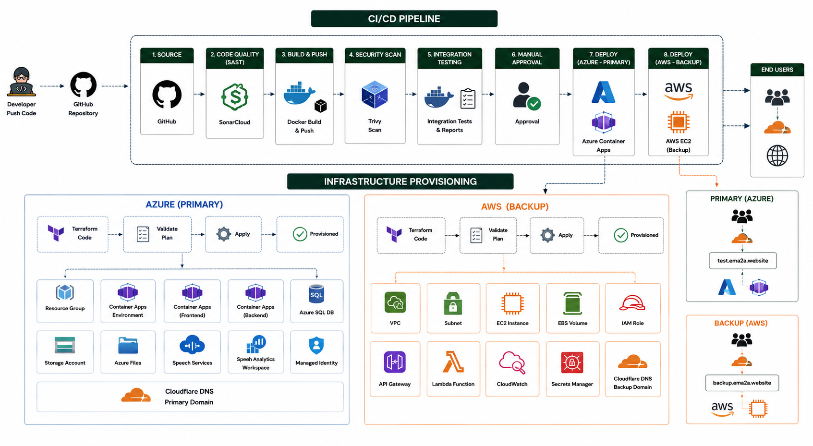
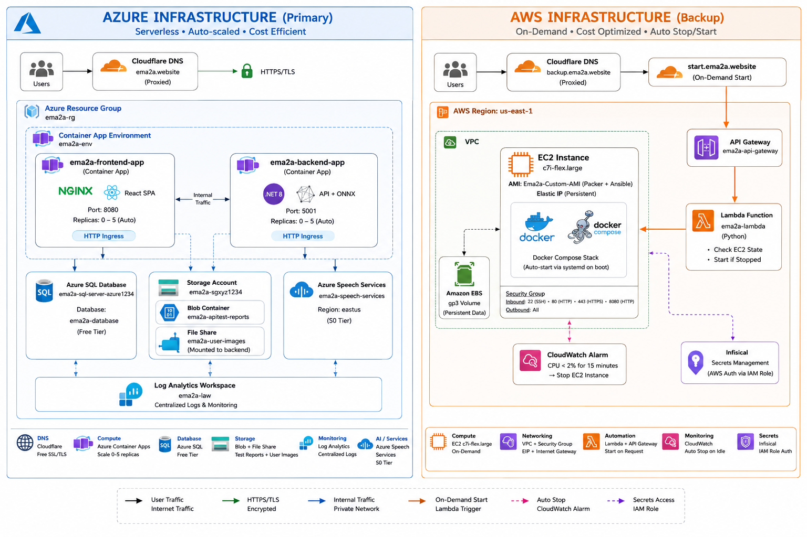
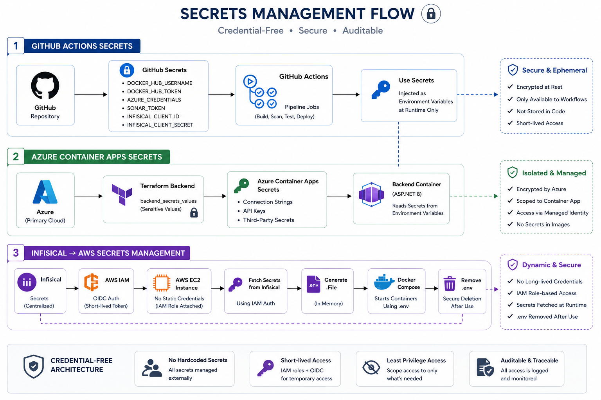
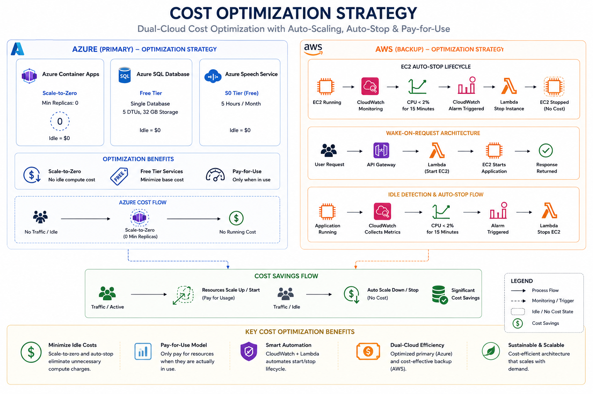

# DevOps Overview — Ema2a Application

> **Project:** Ema2a — Graduation Project  
> **Stack:** .NET 8 (Backend) · React/TypeScript (Frontend) · Flutter (Mobile) · Python (Hardware)  
> **Primary Cloud:** Microsoft Azure  
> **Backup Cloud:** Amazon Web Services  
> **Registry:** Docker Hub (`docker.io/abdelhameed208`)

---

## Table of Contents

1. [System Overview](#1-system-overview)
2. [Technology Stack](#2-technology-stack)
3. [Repository Structure](#3-repository-structure)
4. [Pipeline Summary](#4-pipeline-summary)
5. [Infrastructure Summary](#5-infrastructure-summary)
6. [Containerisation Summary](#6-containerisation-summary)
7. [Security Practices](#7-security-practices)
8. [Secrets Management](#8-secrets-management)
9. [Environments](#9-environments)
10. [Documentation Index](#10-documentation-index)

---

## 1. System Overview



*High-level overview showing the CI/CD pipeline, dual-cloud infrastructure provisioning (Azure + AWS), and runtime architecture with Docker Hub as the central image registry.*

Ema2a is a full-stack application with a multi-cloud deployment strategy. The infrastructure is designed around **cost efficiency** and **reliability**: Azure serves as the primary serverless deployment, while AWS provides a on-demand backup server that auto-starts via a Lambda function when needed and auto-stops when idle.

```
Developer Push
      │
      ▼
┌─────────────────────────────────────────────────────────────┐
│               GitHub Actions CI/CD Pipeline                  │
│                                                             │
│  SAST (SonarCloud) ──► Build Images ──► Security Scan ──►  │
│  Integration Tests ──► Quality Gate ──► Manual Approval ──► │
│  Deploy to Azure Container Apps                             │
└─────────────────────────────────────────────────────────────┘
      │                              │
      ▼                              ▼
┌──────────────┐            ┌──────────────────────┐
│    AZURE     │            │        AWS           │
│  (Primary)   │            │  (Backup / On-Demand)│
│              │            │                      │
│ Container    │            │ EC2 Instance         │
│ Apps (0–5    │            │ (c7i-flex.large)     │
│ replicas)    │            │ Packer AMI + Ansible │
│              │            │ Auto-stop on idle    │
│ Azure SQL    │            │ Lambda wake-on-req   │
│ Azure Files  │            │ Infisical secrets    │
│ Speech API   │            │                      │
└──────────────┘            └──────────────────────┘
      │                              │
      └──────────┬───────────────────┘
                 ▼
         Cloudflare DNS
         (ema2a.website)
```

---

## 2. Technology Stack

### Application

| Layer | Technology | Version |
|-------|-----------|---------|
| Backend API | ASP.NET Core | .NET 8 |
| Frontend | React + TypeScript | Vite build |
| Mobile | Flutter / Dart | 3.41.6 |
| Hardware Service | Python | 3.x |
| Database | Microsoft SQL Server | 2025 |
| AI / ML | ONNX Runtime | (embedded in backend) |
| Real-time | SignalR (WebSocket) | ASP.NET Core |

### DevOps & Infrastructure

| Category | Tool | Purpose |
|----------|------|---------|
| CI/CD | GitHub Actions | Pipeline orchestration |
| Containerisation | Docker + Docker Compose | App packaging & local deployment |
| Container Registry | Docker Hub | Image storage |
| IaC — Azure | Terraform (AVM modules) | Azure resource provisioning |
| IaC — AWS | Terraform (community modules) | AWS resource provisioning |
| Image Building | HashiCorp Packer | Custom AMI creation |
| Configuration Management | Ansible | VM setup and application bootstrap |
| SAST | SonarCloud | Code quality & security analysis |
| Container Security | Aqua Trivy | CVE & secret scanning |
| Deep SAST | GitHub CodeQL | Semantic security analysis |
| DNS | Cloudflare | DNS automation & proxying |
| Secrets (Azure) | Azure Container Apps Secrets | Runtime secret injection |
| Secrets (AWS) | Infisical | Runtime secret fetching via IAM |
| Notifications | Gmail SMTP | Test result emails |
| Dependency Automation | Dependabot | Weekly automated updates |

---

## 3. Repository Structure

```
GraduationProjectDotNet-Deploy/
│
├── .github/
│   ├── workflows/
│   │   ├── main.yml                   ← Primary CI/CD pipeline (8 jobs)
│   │   ├── CodeQl.yml                 ← Deep security analysis
│   │   ├── sonar-flutter.yml          ← Flutter mobile code analysis
│   │   └── sonar-hardware.yml         ← Hardware service code analysis
│   └── dependabot.yml                 ← Automated dependency updates (8 ecosystems)
│
├── backend/
│   ├── Dockerfile                     ← Multi-stage .NET 8 image
│   ├── .env.example                   ← Environment variable reference
│   └── GraduationProjectWebApplication/
│
├── frontend/
│   ├── Dockerfile                     ← Node build → Nginx runtime image
│   ├── nginx-proxy.conf.template      ← Nginx reverse proxy + SPA config
│   └── .dockerignore
│
├── DevOps/
│   ├── Terraform/
│   │   ├── main-azure/                ← Azure Container Apps infrastructure
│   │   │   ├── providers.tf
│   │   │   ├── variables.tf
│   │   │   ├── main.tf
│   │   │   └── outputs.tf
│   │   └── backup-aws/                ← AWS EC2 backup infrastructure
│   │       ├── main.tf
│   │       ├── variables.tf
│   │       └── lambda_src/index.py    ← Lambda: wake EC2 on request
│   │
│   └── packer-ansible/
│       ├── ema2a.pkr.hcl              ← Packer: build AWS AMI
│       └── Ansible/
│           ├── site.yml               ← Master playbook
│           ├── playbooks/             ← 4 playbooks
│           └── roles/                 ← 4 roles: init, docker, gha-setup, deploy
│
├── docker-compose.yml                 ← Production stack (pulls from Hub)
├── docker-compose.local.yml           ← Local dev stack (builds from source)
├── docker-compose-backup-deployment.yml ← AWS EC2 deployment stack
└── sonar-frontend-devops.properties   ← SonarCloud: Frontend + DevOps project
```

---

## 3. Architecture Overview



*Detailed dual-cloud infrastructure architecture showing Azure (Primary) with serverless Container Apps, auto-scaling, and managed services alongside AWS (Backup) with on-demand EC2, Lambda wake-on-request, and CloudWatch auto-stop for cost optimization.*

---

## 4. Pipeline Summary

The primary pipeline (`main.yml`) runs on every push to `DEV` or `main` that touches backend, frontend, or DevOps files. It is structured in **five sequential stages**:

```
Stage 1: SAST (Parallel)
├── sonar-backend          → SonarCloud analysis for .NET backend
└── sonar-frontend-devops  → SonarCloud analysis for React + IaC

Stage 2: Docker Builds (Parallel, after Stage 1 passes)
├── backend-build-push     → Build & push .NET image (1 tag)
└── frontend-build-push    → Build & push React images (Azure + AWS = 2 images)

Stage 3: Security Scanning (Parallel, after Stage 2)
├── trivy-backend          → CVE + secret scan of backend image → GitHub Security tab
└── trivy-frontend         → CVE + secret scan of Azure frontend image

Stage 4: Integration Testing (after Stage 3)
└── test                   → Spin up docker compose → run API tests → upload report
                              → email notification → quality gate (≤10 failures)

Stage 5: Deployment (after Stage 4, requires manual approval)
├── deploy_main            → Deploy to Azure Container Apps (Production - Main env gate)
└── deploy_backup          → Deploy to AWS EC2 via SSM (Production - Backup env gate)
```

**Additional standalone workflows:**
- `CodeQl.yml` — deep semantic analysis (C# + JS/TS) on push to `main`
- `sonar-flutter.yml` — Flutter analysis triggered only when `flutter/**` changes
- `sonar-hardware.yml` — Python analysis triggered only when `Hardware-Service/**` changes

---

## 5. Infrastructure Summary

### Azure (Primary Deployment)

| Resource | Name | Purpose |
|----------|------|---------|
| Resource Group | `GraduationProject-Ema2a` | Logical container for all Azure resources |
| Container App Environment | `ema2a-env` | Shared Kubernetes runtime (westus2) |
| Backend Container App | `ema2a-backend-app` | .NET API, 0–5 replicas, scale to zero |
| Frontend Container App | `ema2a-frontend-app` | Nginx/React, 0–5 replicas, scale to zero |
| Azure SQL Server | `ema2a-sql-server-azure1234` | Managed relational database |
| Azure SQL Database | `ema2a-database` | Application database (Free tier) |
| Storage Account | `ema2asgxyz1234` | Blob (CI reports) + File Share (user images) |
| Azure Files Share | `ema2a-user-images` | Mounted to backend at `/app/wwwroot/Images` |
| Cognitive Services | `ema2a-speech-services` | Azure AI Speech API (TTS/STT), F0 tier |
| Log Analytics Workspace | `ema2a-law` | Centralised container logs (30-day retention) |
| Managed Certificate | *(auto-provisioned)* | TLS for custom domain |
| Cloudflare DNS (TXT) | `asuid.test` | Domain ownership verification |
| Cloudflare DNS (A) | `test.ema2a.website` | Frontend public endpoint |

### AWS (Backup Deployment)

| Resource | Name | Purpose |
|----------|------|---------|
| EC2 Instance | `ema2a-backup-deployment-server` | `c7i-flex.large`, 30 GB EBS, Elastic IP |
| Security Group | `ema2a_server_sg` | Allows 22, 80, 443, 8080 inbound |
| Elastic IP | *(auto-assigned)* | Stable public IP for DNS |
| IAM Role | `ema2a-instance-profile` | Allows EC2 to auth with Infisical |
| CloudWatch Alarm | `auto stop ec2` | Stops EC2 if CPU < 2% for 15 minutes |
| Lambda Function | `ema2a-lambda` | Python 3.12: start/check EC2 on HTTP request |
| API Gateway | `ema2a-api-gateway` | HTTP API → Lambda, domain: `start.ema2a.website` |
| Cloudflare DNS (A) | `backup.ema2a.website` | Instance public endpoint (proxied) |
| Cloudflare CNAME | `start.ema2a.website` | API Gateway wake endpoint |
| Infisical Auth | `aws-auth` | IAM-based machine identity for secrets access |

### Provisioning Flow (AWS)

```
1. packer build  →  Packer launches temp EC2 from Amazon Linux 2023
                     Runs Ansible (init → docker → gha-setup → deploy)
                     Snapshots and publishes AMI with tags:
                       Project=ema2a, Component=server-ami

2. terraform apply  →  Terraform discovers AMI by tag filter
                        Provisions EC2, Security Group, EIP, IAM, Lambda,
                        API Gateway, CloudWatch Alarm, Cloudflare DNS,
                        Infisical auth binding

3. EC2 boot  →  systemd starts ema2a-app.service
                Infisical CLI fetches secrets via AWS IAM auth
                docker compose up -d pulls latest images
                .env deleted from disk immediately after startup
```

---

## 6. Containerisation Summary

Three Docker Compose files serve different purposes:

| File | Used For | Images |
|------|----------|--------|
| `docker-compose.yml` | CI integration tests + Azure production | Pre-built from Docker Hub (`:latest`) |
| `docker-compose.local.yml` | Local developer workflow | Built from source code |
| `docker-compose-backup-deployment.yml` | AWS EC2 backup server | Pre-built from Docker Hub |

### Services

| Service | Image | Port | Network |
|---------|-------|------|---------|
| `backend` | `graduationproject-backend` | 5001 | `local` + `api_network` |
| `frontend` / `nginx` | `graduationproject-frontend` | 80 / 8080 | `api_network` |
| `database` | `mssql/server:2025-latest` | 1433 (internal only) | `local` (isolated) |

### Image Tagging

```
Backend:   abdelhameed208/graduationproject-backend:v1.0-<count>-<sha>
Frontend:  abdelhameed208/graduationproject-frontend:v1.0-<count>-<sha>-azure
           abdelhameed208/graduationproject-frontend:v1.0-<count>-<sha>-aws
```

Two frontend images are built per pipeline run — each compiled with a different backend URL (`VITE_BASE_URI`) baked into the JavaScript bundle.

---

## 7. Security Practices

| Practice | Implementation |
|----------|---------------|
| **SAST on every push** | SonarCloud scans all 4 codebases before any image is built |
| **Container CVE scanning** | Trivy scans every pushed image for HIGH/CRITICAL vulnerabilities |
| **Deep semantic analysis** | GitHub CodeQL runs on `main` for C# and JavaScript/TypeScript |
| **Non-root containers** | Backend runs as `app` user; frontend runs as `nginx` user |
| **Secrets never in images** | All secrets injected via environment variables at runtime |
| **No secrets on disk** | AWS: `.env` file deleted immediately after `docker compose up` |
| **Database isolation** | SQL Server on an `internal: true` Docker network (no external access) |
| **Managed TLS** | Azure Managed Certificates auto-provision and auto-renew |
| **Immutable image tags** | Versioned tags prevent accidental overwrite of deployed images |
| **Manual deploy approval** | `Production` GitHub Environment requires human review before deploy |
| **Limited Lambda permissions** | IAM policy scoped to `StartInstances`/`StopInstances` on the specific EC2 only |
| **Dependabot** | Automated weekly PRs for all 8 dependency ecosystems |

---

## 8. Secrets Management



*Three independent secrets management systems (GitHub Actions, Azure Container Apps, Infisical/AWS) working together to provide a secure, credential-free runtime architecture.*

### Azure — Container Apps Secrets

Application secrets (API keys, JWT, SMTP credentials, Google OAuth) are stored directly as **Azure Container Apps secrets** and injected as environment variables into the backend container at runtime. Terraform provisions these secrets using the `backend_secrets_values` variable map.

### AWS — Infisical (Machine Identity + AWS IAM Auth)

The EC2 instance holds no static credentials. Instead:
1. The instance assumes its IAM role (attached at launch)
2. The `infisical` CLI authenticates using AWS STS (`aws-iam` method)
3. Infisical returns a short-lived access token
4. Secrets are exported to `.env` from Infisical's secret store
5. Docker Compose reads `.env` at startup; the file is then deleted

### GitHub Actions Secrets

Pipeline credentials are stored as **GitHub repository secrets** and never logged or exposed in workflow output. Key secrets include `AZURE_CREDENTIALS`, `DOCKER_PASSWORD`, `SONAR_TOKEN`, and `EMA2A_ENV_FILE_CONTENT`.

---

## 9. Cost Optimization Strategy

The Ema2a application implements a dual-cloud cost optimization strategy that balances high availability with minimal idle costs.



*Dual-cloud cost optimization strategy showing Azure's scale-to-zero serverless architecture alongside AWS's auto-stop EC2 lifecycle and Lambda wake-on-request architecture.*

By combining Azure's serverless pay-for-use model with AWS's aggressive auto-stop and wake-on-request, the system maintains a highly available dual-cloud presence while driving idle compute costs down to nearly zero.

---

## 10. Environments

| Environment | Branch | Deployment Target | Protection |
|-------------|--------|-------------------|------------|
| Development | `DEV` | *(CI tests only, no auto-deploy)* | None |
| Production - Main | `main` | Azure Container Apps | Manual approval required via GitHub Environments |
| Production - Backup | `main` | AWS EC2 | Auto-deploy via GitHub Actions (AWS SSM + OIDC) |

---

## 11. Documentation Index

Detailed documentation for each DevOps domain is available in the files below:

| File | Contents |
|------|----------|
| [`Docker.md`](./Docker.md) | All Dockerfiles, Compose files, Nginx config, networking, volumes, build instructions |
| [`Provisioning&&Infra.md`](./Provisioning&&Infra.md) | Terraform (Azure + AWS), Packer, Ansible roles, systemd service, end-to-end provisioning flow |
| [`CI-CD.md`](./CI-CD.md) | All GitHub Actions workflows, job-by-job breakdown, tag strategy, quality gates, secrets reference |
