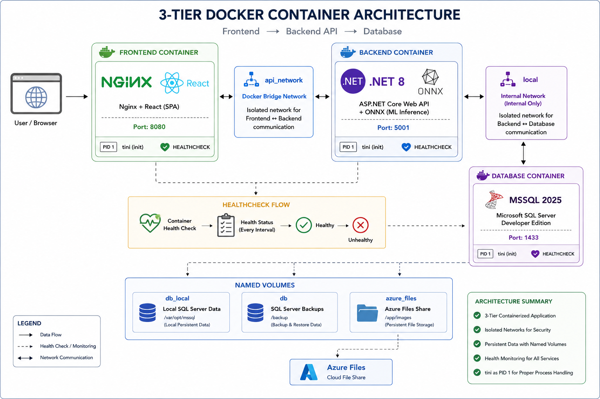
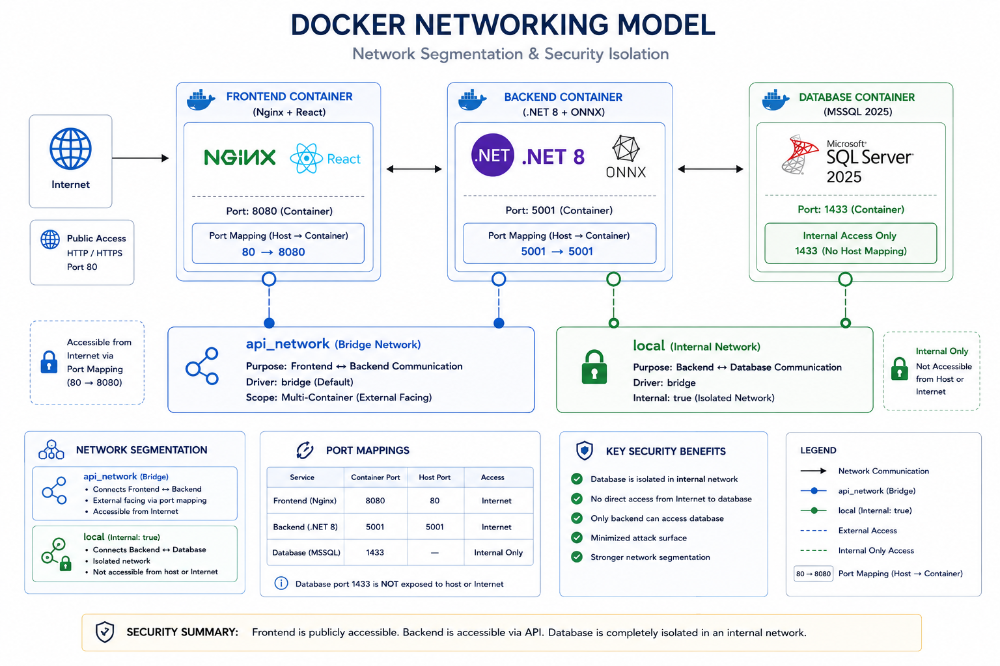

# Docker Documentation — Ema2a Application

> **Project:** Ema2a Graduation Project  
> **Registry:** `docker.io/abdelhameed208`  
> **Backend Image:** `graduationproject-backend`  
> **Frontend Image:** `graduationproject-frontend`

---

## Table of Contents

1. [Architecture Overview](#1-architecture-overview)
2. [Backend Dockerfile](#2-backend-dockerfile)
3. [Frontend Dockerfile](#3-frontend-dockerfile)
4. [Nginx Reverse-Proxy Configuration Template](#4-nginx-reverse-proxy-configuration-template)
5. [docker-compose.yml — Production Deployment (Azure)](#5-docker-composeyml--production-deployment-azure)
6. [docker-compose.local.yml — Local Development](#6-docker-composelocalyml--local-development)
7. [docker-compose-backup-deployment.yml — AWS Backup Deployment](#7-docker-compose-backup-deploymentyml--aws-backup-deployment)
8. [Environment Variables Reference](#8-environment-variables-reference)
9. [Networking Model](#9-networking-model)
10. [Volume Strategy](#10-volume-strategy)
11. [Build & Run Instructions](#11-build--run-instructions)
12. [Design Decisions](#12-design-decisions)

---

## 1. Architecture Overview

The Ema2a application is a three-tier containerised system:



*Three-tier Docker container architecture showing the Frontend (Nginx+React), Backend (.NET 8+ONNX), and Database (MSSQL) with their network isolation and volume mounts.*

| Component | Base Image | Role |
|-----------|-----------|------|
| Backend | `mcr.microsoft.com/dotnet/aspnet:8.0-jammy` | REST API + SignalR |
| Frontend | `nginx:1.29.6-alpine3.23` | SPA host + reverse proxy |
| Database | `mcr.microsoft.com/mssql/server:2025-latest` | Persistent relational data |

---

## 2. Backend Dockerfile

**File:** `backend/Dockerfile`

### Purpose

Produces a minimal, production-hardened `.NET 8` (ASP.NET Core) runtime image. Uses a multi-stage build to keep the final image free of SDK tooling, source code, and build artifacts.

### Full Annotated Dockerfile

```dockerfile
# ============================================================
# Stage 1: Build
# Uses the full .NET 8 SDK on Ubuntu 22.04 (Jammy) to compile
# ============================================================
FROM mcr.microsoft.com/dotnet/sdk:8.0-jammy AS build

WORKDIR /src

# Copy entire backend source tree
COPY . ./

# Restore NuGet packages for the primary project
RUN dotnet restore GraduationProjectWebApplication/GraduationProjectWebApplication.csproj

# Publish in Release mode to /app/publish — strips debug symbols and
# produces a self-contained, optimised binary set
RUN dotnet publish -c Release -o /app/publish

# ============================================================
# Stage 2: Runtime
# Uses only the ASP.NET Core runtime — no SDK, no source
# ============================================================
FROM mcr.microsoft.com/dotnet/aspnet:8.0-jammy AS runtime

WORKDIR /app

# Security patch: update all OS packages and install minimal extras
# libgomp1  → required by ONNX Runtime (AI/ML inference)
# curl      → used by the HEALTHCHECK instruction
# tini      → PID 1 init process for proper signal handling
RUN apt-get update && apt-get upgrade -y \
    && apt-get install -y --no-install-recommends libgomp1 curl tini \
    && rm -rf /var/lib/apt/lists/*

# Copy compiled output from build stage; set ownership to built-in 'app' user
COPY --chown=app:app --from=build /app/publish .

# Copy AI model files (ONNX) required at runtime
COPY --chown=app:app GraduationProjectWebApplication/AIModels/ ./AIModels

EXPOSE 5001

# ── .NET Garbage Collection Tuning (ML workload optimisation) ──
# Server GC: multi-threaded mode optimised for server/web workloads
ENV DOTNET_gcServer=1
# Use exactly 2 GC heaps (match available CPU cores on target VM)
ENV DOTNET_GCHeapCount=2
# Disable memory-conservation mode → more aggressive collection
ENV DOTNET_GCConserveMemory=0
# Hard heap limit = 1.5 GB (0x60000000), leaves headroom for native ONNX memory
ENV DOTNET_GCHeapHardLimit=0x60000000
# Concurrent GC for better latency/responsiveness
ENV DOTNET_gcConcurrent=1

# Run as the non-root 'app' user (built into the ASP.NET base image)
USER app

# Health probe: polls /health every 30 s; 80 s grace period for first boot
HEALTHCHECK --interval=30s --timeout=5s --start-period=80s --retries=3 \
            CMD curl -f http://localhost:5001/health || exit 1

# tini acts as PID 1 and forwards signals correctly to the .NET process
ENTRYPOINT ["/usr/bin/tini", "--"]
CMD ["dotnet", "GraduationProjectWebApplication.dll"]
```

### Stage-by-Stage Explanation

| Stage | Base Image | Key Actions |
|-------|-----------|-------------|
| `build` | `dotnet/sdk:8.0-jammy` | Restore → Publish Release |
| `runtime` | `dotnet/aspnet:8.0-jammy` | Security patch, copy artifacts, configure GC |

### Environment Variables (Runtime)

| Variable | Value | Purpose |
|----------|-------|---------|
| `DOTNET_gcServer` | `1` | Enable server GC mode |
| `DOTNET_GCHeapCount` | `2` | Number of GC heaps |
| `DOTNET_GCConserveMemory` | `0` | Disable memory conservation |
| `DOTNET_GCHeapHardLimit` | `0x60000000` | ~1.5 GB hard heap limit |
| `DOTNET_gcConcurrent` | `1` | Enable concurrent GC |
| `ASPNETCORE_URLS` | `http://+:5001` | Injected via Compose |
| `DEFAULT_CONNECTION` | (injected via Compose) | SQL Server connection string |

### Key Design Decisions

- **Multi-stage build** — SDK (~800 MB) is discarded; final image uses only the runtime (~220 MB).
- **`tini` as PID 1** — ensures zombie process reaping and correct `SIGTERM` propagation for graceful shutdown.
- **`libgomp1`** — required by the ONNX Runtime library used for on-premise AI model inference without calling an external API.
- **Non-root execution** — the `app` user is a built-in, no-login user in the base image, reducing attack surface.
- **`/health` endpoint** — the healthcheck enables Docker (and orchestrators) to know the app is fully initialised before routing traffic.

### Build Instructions

```bash
# Build the image locally
docker build -t graduationproject-backend:local ./backend

# Run standalone (requires a SQL Server to be reachable)
docker run -d \
  -p 5001:5001 \
  -e ASPNETCORE_URLS="http://+:5001" \
  -e DEFAULT_CONNECTION="Server=<host>,1433;Database=<db>;User Id=<user>;Password=<pass>;Trust Server Certificate=True" \
  --name backend-local \
  graduationproject-backend:local
```

---

## 3. Frontend Dockerfile

**File:** `frontend/Dockerfile`

### Purpose

Produces a hardened Nginx image that serves the pre-built React SPA and acts as a reverse proxy for API calls and WebSocket connections. The React application is compiled at build-time with the target API base URL burned in via a build argument (`VITE_BASE_URI`), enabling environment-specific image variants without runtime environment injection.

### Full Annotated Dockerfile

```dockerfile
# ============================================================
# Stage 1: Build the React Application
# ============================================================
FROM node:alpine3.23 AS Build

WORKDIR /app

# Install dependencies using package-lock.json for reproducibility
COPY ./package*.json ./
RUN npm install

# Copy all source files
COPY . .

# Accept backend URL as a build argument (baked into the JS bundle at build time)
ARG VITE_BASE_URI

# Expose the ARG as an ENV so Vite picks it up during `npm run build`
ENV VITE_BASE_URI=$VITE_BASE_URI

# Run the Vite production build — output lands in /app/dist
RUN npm run build

# ============================================================
# Stage 2: Serve with Nginx
# ============================================================
FROM nginx:1.29.6-alpine3.23

# Apply any Alpine security patches
RUN apk upgrade --no-cache

# Image metadata
LABEL maintainer="abdelhameednael27@gmail.com" \
      version="2.0" \
      description="Production Grade Frontend Image for Ema2a Graduation Project"

# Remove Nginx's default static content
RUN rm -rf /usr/share/nginx/html/*

# Copy the compiled SPA assets from the build stage; set ownership to nginx user
COPY --from=Build --chown=nginx:nginx /app/dist /usr/share/nginx/html

# Copy the Nginx configuration template (uses Docker's envsubst mechanism)
COPY ./nginx-proxy.conf.template /etc/nginx/templates/default.conf.template

# Harden directory permissions so Nginx runs as non-root (nginx user)
RUN chown -R nginx:nginx /var/cache/nginx /var/run /run /tmp /usr/share/nginx /etc/nginx/conf.d && \
    chmod -R 2775 /var/cache/nginx /var/run /tmp /etc/nginx/conf.d /run && \
    chmod -R 755 /usr/share/nginx/html && \
    echo 'umask 0002' >> /etc/profile && \
    echo 'umask 0002' >> /home/nginx/.profile 2>/dev/null || true

EXPOSE 8080

# Run as the built-in non-root nginx user
USER nginx
```

### Stage-by-Stage Explanation

| Stage | Base Image | Key Actions |
|-------|-----------|-------------|
| `Build` | `node:alpine3.23` | Install deps + compile SPA with Vite |
| Runtime | `nginx:1.29.6-alpine3.23` | Serve static assets + template-based Nginx config |

### Build Argument

| Argument | Required | Purpose |
|----------|----------|---------|
| `VITE_BASE_URI` | **Yes** | Backend API base URL baked into the compiled JavaScript bundle |

Two separate images are built from this single Dockerfile in CI — one per deployment target:

| Image Tag Suffix | `VITE_BASE_URI` Value |
|-----------------|----------------------|
| `*-azure` | Azure Container Apps backend URL (`VITE_BASE_URI_AZURE` secret) |
| `*-aws` | AWS EC2 server backend URL (`VITE_BASE_URI_AWS` secret) |

### Key Design Decisions

- **Build-time URL baking** — Vite bundles processes `import.meta.env.VITE_BASE_URI` at compile time. The final JavaScript is completely static; no environment variable injection is needed at runtime in the container.
- **Alpine base** — extremely small (~10 MB) resulting in a minimal attack surface.
- **Nginx template mechanism** — the `default.conf.template` file is placed in `/etc/nginx/templates/`. Nginx's official Docker image automatically runs `envsubst` on this file at container startup, replacing `${BACKEND_URL}` and similar shell variables before starting the web server.
- **Non-root nginx user** — all directories are pre-chowned so Nginx can operate without root privileges.

### Build Instructions

```bash
# Build Azure variant
docker build \
  --build-arg VITE_BASE_URI=https://your-azure-backend-url.azurecontainerapps.io \
  -t graduationproject-frontend:azure \
  ./frontend

# Build AWS variant
docker build \
  --build-arg VITE_BASE_URI=https://backup.ema2a.website \
  -t graduationproject-frontend:aws \
  ./frontend
```

### `.dockerignore` — `frontend/.dockerignore`

The following are excluded from the build context to reduce size and prevent leaking sensitive or irrelevant files:

```
node_modules/      # Re-installed inside the container
dist/              # Build output (rebuilt inside container)
.git/
.gitignore
Dockerfile
.dockerignore
README.md
```

---

## 4. Nginx Reverse-Proxy Configuration Template

**File:** `frontend/nginx-proxy.conf.template`

### Purpose

Serves as Nginx's virtual-host configuration. It handles four distinct concerns: static SPA file serving, API proxying, WebSocket proxying, and bot/threat blocking. At container startup, Docker's built-in `envsubst` replaces `${BACKEND_URL}` and `${BACKEND_HOST}` with concrete values from the container's environment.

### Full Configuration with Annotations

```nginx
server {
    listen 8080;
    server_name backup.ema2a.website www.backup.ema2a.website;

    # Root directory for your frontend build files
    root /usr/share/nginx/html;
    index index.html;

    # 1. ACME Challenge (Optional if using Azure Managed Certs, but good for local/manual tests)
    location /.well-known/acme-challenge/ {
        root /usr/share/nginx/html;
    }
    
    # 2. Frontend Routing (SPA Support)
    location / {
       
        try_files $uri /index.html;
    }
 
    # 3. Prevent Scammers and Hackers Bots 
    location ~* (wp-admin|wp-includes|wp-login|wp-content|setup-config|install\.php|xmlrpc\.php|\.env|\.git|\.php$) {
        return 444; 
    }

    # 4. API Proxying
    location /api/ {
        # CORS Preflight Handling
        if ($request_method = 'OPTIONS') {
            add_header 'Access-Control-Allow-Origin' '*' always;
            add_header 'Access-Control-Allow-Methods' 'GET, POST, PUT, DELETE, OPTIONS' always;
            add_header 'Access-Control-Allow-Headers' 'DNT,User-Agent,X-Requested-With,If-Modified-Since,Cache-Control,Content-Type,Range,Authorization' always;
            add_header 'Access-Control-Max-Age' 1728000;
            add_header 'Content-Type' 'text/plain; charset=utf-8';
            add_header 'Content-Length' 0;
            return 204;
        }

        proxy_pass ${BACKEND_URL};
        
        # Identity Headers
        # FIX: Use $host (the public domain the client sent) NOT $proxy_host (the internal backend hostname).
        # This ensures X-Forwarded-Host and the actual Host header reflect the public domain,
        # so ASP.NET's UseForwardedHeaders() builds the correct Google OAuth redirect URI.
        proxy_set_header Host $host;
        proxy_set_header X-Forwarded-Host $host;
        proxy_set_header X-Real-IP $remote_addr;
        proxy_set_header X-Forwarded-For $proxy_add_x_forwarded_for;
        
        # FIX: TLS is terminated upstream (Cloudflare / load-balancer) before reaching this Nginx.
        # At this point $scheme is always "http" because Nginx receives plain HTTP internally.
        # We must hardcode "https" so ASP.NET Core builds the correct OAuth redirect URI:
        # https://backup.ema2a.website/api/signin-google  (not http://)
        proxy_set_header X-Forwarded-Proto https;
        proxy_set_header X-Forwarded-Port 443;
        proxy_set_header Authorization $http_authorization;

        # Connection Upgrades (Crucial for performance/stability)
        proxy_http_version 1.1;
        proxy_set_header Upgrade $http_upgrade;
        proxy_set_header Connection "upgrade";
        
        # SNI support for Azure-to-Azure communication
        proxy_ssl_server_name on;
    }

    # 5. WebSockets (SignHub)
    location /signHub {
        proxy_pass ${BACKEND_URL};
        
        # Standard WebSocket Headers
        proxy_http_version 1.1;
        proxy_set_header Upgrade $http_upgrade;
        proxy_set_header Connection "upgrade";
        
        proxy_set_header Host $host;
        proxy_set_header X-Forwarded-Host $host;
        proxy_set_header X-Real-IP $remote_addr;
        proxy_set_header X-Forwarded-For $proxy_add_x_forwarded_for;
        proxy_set_header X-Forwarded-Proto https;

        # Disable buffering for real-time data
        proxy_buffering off;

        # Long timeouts for persistent connections
        proxy_read_timeout 86400;
        proxy_send_timeout 86400;

        # SNI support for Azure-to-Azure communication
        proxy_ssl_server_name on;
    }
}
```

### Runtime Environment Variables (injected via `envsubst`)

| Variable | Example Value | Description |
|----------|--------------|-------------|
| `BACKEND_URL` | `http://backend:5001` | Full URL to the backend container |
| `BACKEND_HOST` | `backend:5001` | Host:port used in some header contexts |
| `CERT_PATH` | `./Dev` | Path to TLS cert (local mode only) |
| `ARCHIVE_PATH` | `./Dev` | Path to TLS archive (local mode only) |

---

## 5. `docker-compose.yml` — Production Deployment (Azure)

**File:** `docker-compose.yml`  
**Used by:** Integration test job in CI; primary production compose file referenced by the Azure deployment systemd service.

### Purpose

Defines the three-service production stack using **pre-built images** pulled from Docker Hub. No local build context is referenced. Intended to be the compose file pulled and executed on the deployment server at startup.

### Services

#### `backend`

```yaml
backend:
  image: abdelhameed208/graduationproject-backend:latest
  ports:
    - "5001:5001"
  restart: always
  deploy:
    resources:
      limits:
        cpus: '2'
        memory: '256M'
      reservations:
        memory: '128M'
  networks:
    - local
    - api_network
  depends_on:
    database:
      condition: service_healthy   # Waits for SQL Server healthcheck to pass
  env_file:
    - ./.env
  environment:
    - ASPNETCORE_URLS=http://+:5001
    - DEFAULT_CONNECTION=Server=${DB_HOST},1433;Database=${DB_NAME};User Id=${DB_USER};Password=${DB_ADMIN_PASS};Trust Server Certificate=True
    - ASPNETCORE_ENVIRONMENT=Development
```

Key points:
- Uses `service_healthy` condition, ensuring the database is accepting connections before the backend starts.
- Connected to both `local` (for DB access) and `api_network` (for frontend access).
- CPU capped at 2 cores; memory hard-limited to 256 MB, soft-reserved at 128 MB.
- `DB_HOST` is provided via `.env` and points to the SQL Server container name (`database`) or an external host.

#### `frontend`

```yaml
frontend:
  image: abdelhameed208/graduationproject-frontend:latest
  build:
    context: .
    args:
      - VITE_BASE_URI=${VITE_BASE_URI}
  environment:
    CERT_PATH: ${CERT_PATH:-./Dev}
    ARCHIVE_PATH: ${ARCHIVE_PATH:-./Dev}
    BACKEND_URL: ${BACKEND_URL:-http://backend:5001}
    BACKEND_HOST: ${BACKEND_HOST:-backend:5001}
  ports:
    - "80:8080"
  restart: always
  depends_on:
    - backend
  networks:
    - api_network
```

Key points:
- Exposes port 8080 (inside container) on host port 80.
- `BACKEND_URL` defaults to `http://backend:5001`, using Docker's internal DNS.
- Connected only to `api_network` — has no direct access to the database.
- `depends_on: backend` controls startup order (not readiness).

#### `database`

```yaml
database:
  image: mcr.microsoft.com/mssql/server:2025-latest
  environment:
    - ACCEPT_EULA=Y
    - MSSQL_SA_PASSWORD=${DB_ADMIN_PASS}
    - DB_USER=${DB_USER}
  volumes:
    - db:/var/opt/mssql
  networks:
    - local
  restart: always
    healthcheck:
      test: ["CMD-SHELL", "/opt/mssql-tools18/bin/sqlcmd -S localhost -U ${DB_USER} -P ${DB_ADMIN_PASS} -C -Q 'SELECT 1' || exit 1"]
    interval: 30s
    timeout: 10s
    retries: 5
    start_period: 60s
```

Key points:
- Connected **only** to the `local` (internal) network — completely isolated from the public `api_network`.
- Uses a named volume `db` for data persistence across container restarts.
- The healthcheck uses `sqlcmd` to verify SQL Server is fully ready before the backend starts.
- `start_period: 60s` gives SQL Server adequate time to complete its initialisation before health probes begin.

---

## 6. `docker-compose.local.yml` — Local Development

**File:** `docker-compose.local.yml`

### Purpose

Intended for local developer use. Key differences from the production compose file:

| Feature | Production (`docker-compose.yml`) | Local (`docker-compose.local.yml`) |
|---------|----------------------------------|-------------------------------------|
| Images | Pre-built from Docker Hub | Built from local source code |
| DB port | Not exposed | Port `1433` exposed for local DB tools |
| Frontend port | `80:8080` | `8080:8080`, `8443:443` |
| TLS volumes | Not mounted | Mounted for local cert testing |
| Connection string | Uses `${DB_HOST}` variable | Hardcoded to `database` (service name) |

### Notable Differences

```yaml
# Backend — builds from source
backend:
  build:
    context: ./backend
    dockerfile: Dockerfile
  environment:
    - DEFAULT_CONNECTION=Server=database,1433;...  # Hardcoded service name

# Frontend — builds from source + mounts TLS certs
frontend:
  build:
    context: ./frontend
    dockerfile: Dockerfile
    args:
      - VITE_BASE_URI=${VITE_BASE_URI}
  volumes:
    - ${CERT_PATH:-./Dev}:/etc/letsencrypt/live/emaaha.ddns.net:ro
    - ${ARCHIVE_PATH:-./Dev}:/etc/letsencrypt/archive/emaaha.ddns.net:ro
  ports:
    - "8080:8080"
    - "8443:443"

# Database — exposes port for direct client access
database:
  ports:
    - "1433:1433"
  volumes:
    - db_local:/var/opt/mssql   # Separate named volume from production
```

---

## 7. `docker-compose-backup-deployment.yml` — AWS Backup Deployment

**File:** `docker-compose-backup-deployment.yml`

### Purpose

Used on the AWS EC2 backup deployment server. Compared to the main production compose file:

| Feature | Production | Backup (AWS) |
|---------|-----------|-------------|
| Frontend image | `graduationproject-frontend` | `graduationproject-nginx` (separate image) |
| Frontend ports | `80:8080` | `80:80`, `443:443` |
| Backend memory limit | `256M` | `512M` (reserved) |
| Backend env_file | `./.env` loaded | Uses `.env` generated at runtime by Infisical CLI |

### Key Difference — Nginx Image

The backup deployment uses a **dedicated nginx image** (`graduationproject-nginx`) and exposes both HTTP (80) and HTTPS (443) directly. This is appropriate for a standalone EC2 instance that terminates TLS itself, unlike Azure which uses managed certificates at the Container Apps environment layer.

```yaml
nginx:
  image: abdelhameed208/graduationproject-nginx:latest
  ports:
    - "80:80"
    - "443:443"
```

The backend on the backup deployment has higher resource limits (512 MB reserved) to handle the full workload on a single EC2 instance instead of the auto-scaled Container Apps replicas used in Azure.

---

## 8. Environment Variables Reference

Create a `.env` file at the repository root based on `backend/.env.example`:

| Variable | Context | Description |
|----------|---------|-------------|
| `DB_HOST` | Compose (prod) | SQL Server host address |
| `DB_NAME` | Compose | Database name |
| `DB_USER` | Compose | SQL Server login username |
| `DB_ADMIN_PASS` | Compose | SQL Server SA/admin password |
| `VITE_BASE_URI` | Compose + Dockerfile ARG | Backend API base URL baked into frontend build |
| `BACKEND_URL` | Compose → Nginx envsubst | Full backend URL for Nginx proxy_pass |
| `BACKEND_HOST` | Compose → Nginx envsubst | Backend host:port |
| `CERT_PATH` | Compose (local only) | Host path to TLS live cert directory |
| `ARCHIVE_PATH` | Compose (local only) | Host path to TLS archive directory |
| `CORRECT_SENTENCE_KEY` | Backend app | API key for sentence correction service |
| `GENERATE_AUDIO_KEY` | Backend app | API key for TTS audio generation |
| `GENERATE_TEXT_FROM_AUDIO_KEY` | Backend app | API key for STT service |
| `SECRET_KEY` | Backend app | JWT signing secret |
| `ISSUER` | Backend app | JWT issuer claim |
| `GOOGLE_CLIENT_ID` | Backend app | Google OAuth client ID |
| `GOOGLE_CLIENT_SECRET` | Backend app | Google OAuth client secret |
| `MAIL_HOST` | Backend app | SMTP server hostname |
| `MAIL_PORT` | Backend app | SMTP port (587) |
| `MAIL_EMAIL_ID` | Backend app | Sender email address |
| `MAIL_PASSWORD` | Backend app | SMTP authentication password |

---

## 9. Networking Model

Two Docker networks are defined in all compose files:



*Docker networking model showing the `api_network` (bridge) for public-facing communication and the isolated `local` network (internal: true) protecting the database.*

| Network | Driver | Internal | Members |
|---------|--------|----------|---------|
| `api_network` | bridge | No (external access allowed) | `frontend`, `backend` |
| `local` | bridge | **Yes** (no external routing) | `backend`, `database` |

The `local` network with `internal: true` means **the database is completely unreachable from outside the Docker host** — it can only be accessed by containers on the same network, providing a critical security isolation layer.

---

## 10. Volume Strategy

| Volume Name | Compose File | Mount Path | Purpose |
|-------------|-------------|-----------|---------|
| `db` | `docker-compose.yml`, `docker-compose-backup-deployment.yml` | `/var/opt/mssql` | Production database persistence |
| `db_local` | `docker-compose.local.yml` | `/var/opt/mssql` | Local development database (isolated from prod data) |

Named volumes are managed by Docker and persist across `docker compose down` restarts. Only `docker compose down -v` removes them.

---

## 11. Build & Run Instructions

### Production (Pull pre-built images)

```bash
# 1. Create the .env file from the example
cp backend/.env.example .env
# Edit .env and fill in all required values

# 2. Pull and start all services in detached mode
docker compose up -d

# 3. Check service status
docker compose ps

# 4. View backend logs
docker compose logs -f backend

# 5. Stop all services (data persists)
docker compose down

# 6. Stop and remove all data volumes (DESTRUCTIVE)
docker compose down -v
```

### Local Development (Build from source)

```bash
# 1. Create .env and set VITE_BASE_URI to your local backend URL
cp backend/.env.example .env
echo "VITE_BASE_URI=http://localhost:5001" >> .env

# 2. Build images from source and start
docker compose -f docker-compose.local.yml up -d --build

# 3. Access the application
# Frontend: http://localhost:8080
# Backend:  http://localhost:5001
# Database: localhost:1433 (with a SQL client tool)
```

### Build Individual Images

```bash
# Backend image
docker build -t graduationproject-backend ./backend

# Frontend image (Azure target)
docker build \
  --build-arg VITE_BASE_URI=https://api.azure.ema2a.website \
  -t graduationproject-frontend:azure \
  ./frontend

# Frontend image (AWS target)
docker build \
  --build-arg VITE_BASE_URI=https://backup.ema2a.website \
  -t graduationproject-frontend:aws \
  ./frontend
```

---

## 12. Design Decisions

| Decision | Rationale |
|----------|-----------|
| **Multi-stage builds** | Eliminates SDK, source code, and build tools from final images, reducing size and attack surface. |
| **Separate Azure/AWS frontend images** | Vite bakes the API base URL into the bundle at compile time; runtime injection is not possible without rebuilding. |
| **Internal `local` network** | Database is completely isolated from public internet; only the backend can reach it. |
| **`service_healthy` depends_on** | Ensures backend does not start until SQL Server is actually accepting queries, preventing startup race conditions. |
| **`tini` as PID 1** | Prevents zombie process accumulation and correctly forwards `SIGTERM` to the .NET runtime for graceful shutdown. |
| **GC tuning for ML workloads** | The backend hosts ONNX Runtime AI models. Server GC mode with explicit heap limits prevents the GC from competing with native ONNX memory allocations. |
| **Nginx `envsubst` template** | Allows a single Nginx config file to work across environments (local, AWS, Azure) by substituting the backend URL at container startup. |
| **Non-root users in all images** | Both `app` (backend) and `nginx` (frontend) run as non-privileged users, following security least-privilege principle. |
| **`apk upgrade` / `apt upgrade`** | Applied in both Dockerfiles to ensure OS-level security patches are applied at image build time. |
